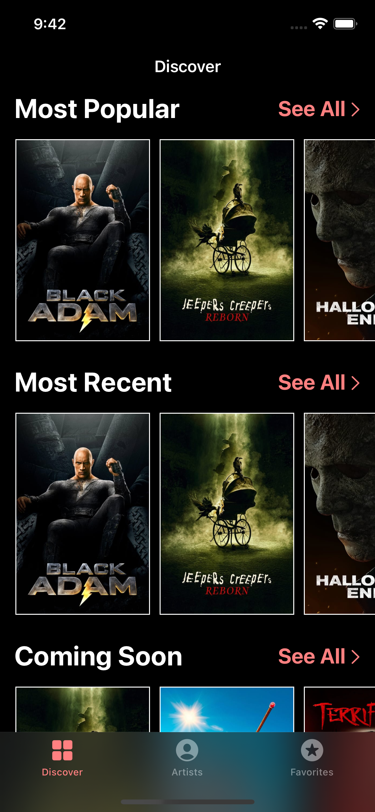
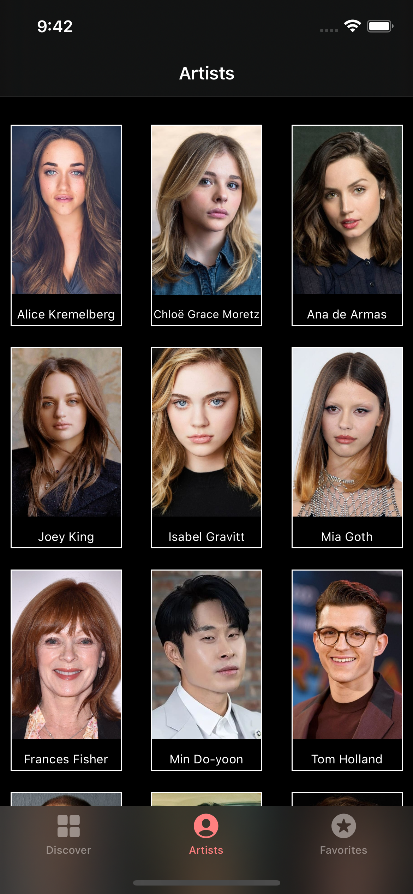
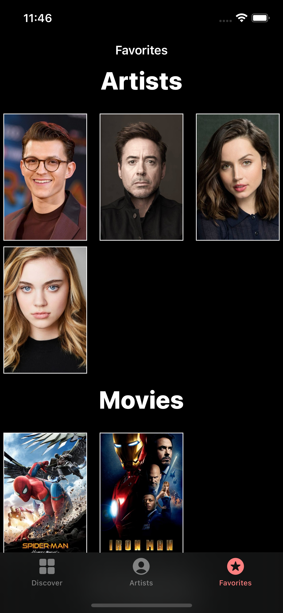
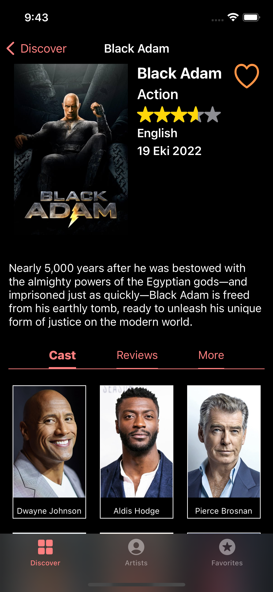
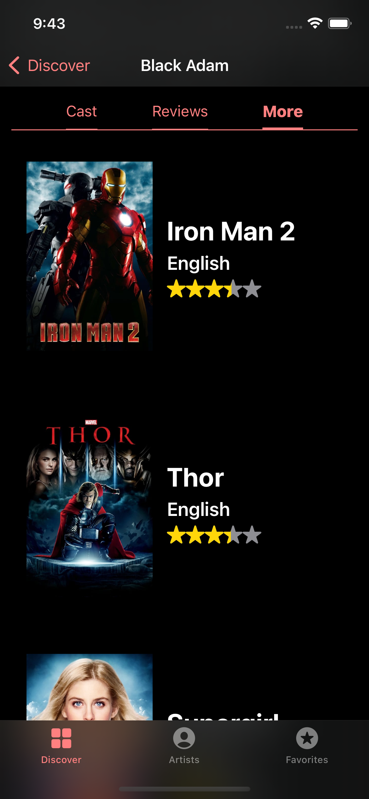
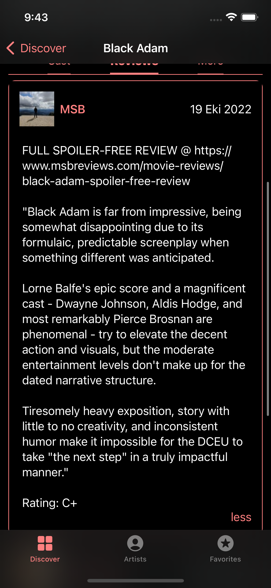
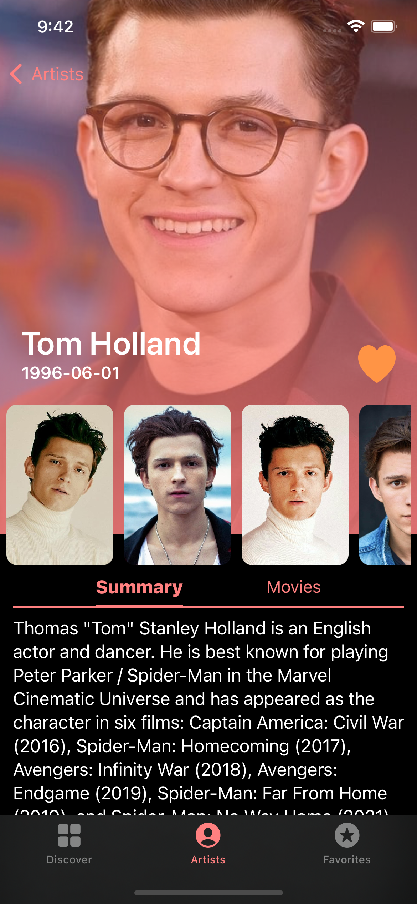
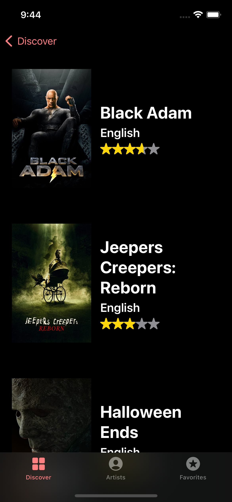

# Watchlist

Watchlist is a Movie/Series Listing app. Will be used as a workspace for learning swiftUI. TMDB will be used as Backend. 

# Features

- SwiftUI
- Used VIPER
- Swiftlint and Kingfisher as 3rd party libraries.
- Supports both Movies and TV Series
- Unit Tests
- Core Data for favoriting movies, series and artists
- Dark/Light theme support

# Screenshots

- Dashboard

- Artist List

- Favorites List

- Movie Detail

- Movie More/Similar

- Movie Review

- Artist Detail

- See All Movies/Series

